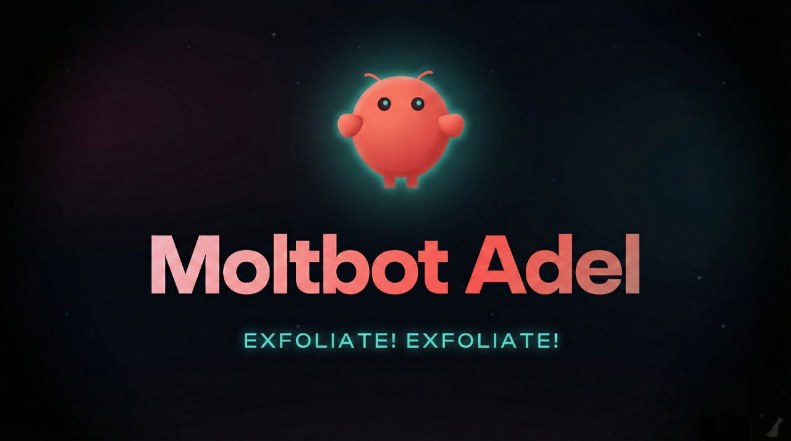

<p align="center">
  
</p>

<h1 align="center">Moltbot Adel</h1>

<p align="center">
  An enhanced fork of <a href="https://github.com/openclaw/openclaw">OpenClaw</a> focused on a reliable Telegram experience on Node.js 22+, safer defaults, and copy‑pasteable setup templates.
</p>

<p align="center">
  
  
  
</p>

---

## What this repo is

This repository contains the full upstream OpenClaw codebase **plus** the changes we made locally (Telegram fix + docs + safe config template). It’s meant to be cloned onto any server so you get the *same* behavior/features you have on your current machine — without exposing your paid API keys.

---

## What’s improved in Moltbot Adel

### 1) Telegram reliability fix on Node.js 22+ (critical)

**Problem:** On Node.js 22+, Telegram requests can fail with `fetch failed` / `ConnectTimeoutError` on many networks because DNS resolution often returns IPv6 first, and IPv6 to Telegram may be unreliable.

**Fix included:**
- Code change in `src/telegram/fetch.ts`
- When Telegram’s `autoSelectFamily` is disabled, we also set:
  - `dns.setDefaultResultOrder("ipv4first")`

This keeps Telegram stable on networks with broken/partial IPv6.

### 2) Ready-to-use config template (no secrets committed)

This repo includes a safe template you can copy on any server:
- `config.example.json`

It uses placeholders like:
- `YOUR_TELEGRAM_BOT_TOKEN_FROM_BOTFATHER`
- `YOUR_OPENAI_API_KEY`
- `https://api.your-provider.com/v1`

So your friends can clone the repo safely and add their own API keys.

### 3) Vector memory enabled in the template

The template turns on OpenClaw’s memory search (hybrid text + vector weighting) so you get strong recall behavior out of the box.

### 4) Security hardening guidance

This repo documents the safe defaults and recommended hardening steps:
- Keep gateway bound to localhost (`bind: loopback`)
- Use a strong gateway token
- Restrict config permissions (`chmod 600`)
- Optional: run ClawdGuard for a security scan

---

## Quick start (fresh server)

### Requirements
- Node.js 22+
- pnpm

### Install

```bash
# Clone

git clone https://github.com/bumblebees002/moltbot-adel.git
cd moltbot-adel

# Install dependencies
pnpm install

# Create config directory
mkdir -p ~/.openclaw

# Copy template config
cp config.example.json ~/.openclaw/openclaw.json

# Edit config (add your API key, base URL, telegram token, etc.)
nano ~/.openclaw/openclaw.json

# Lock down config permissions
chmod 600 ~/.openclaw/openclaw.json

# Run gateway
pnpm openclaw gateway run --bind loopback --port 18789
```

---

## Configuration (what you must set)

### Telegram
Create a bot in Telegram using @BotFather and paste the token:

```json
{
  "channels": {
    "telegram": {
      "token": "YOUR_TELEGRAM_BOT_TOKEN_FROM_BOTFATHER",
      "network": {
        "autoSelectFamily": false
      }
    }
  }
}
```

### LLM Provider (OpenAI / Anthropic / OpenAI-compatible)

You must set:
- `baseUrl`
- `apiKey`
- the `models` you want

Example OpenAI:

```json
{
  "models": {
    "providers": {
      "openai": {
        "baseUrl": "https://api.openai.com/v1",
        "apiKey": "YOUR_OPENAI_API_KEY",
        "models": [{ "id": "gpt-4o" }]
      }
    }
  }
}
```

Example OpenAI-compatible provider:

```json
{
  "models": {
    "providers": {
      "custom": {
        "baseUrl": "https://api.your-provider.com/v1",
        "apiKey": "YOUR_CUSTOM_API_KEY",
        "models": [
          {
            "id": "your-model-id",
            "compat": { "supportsDeveloperRole": false }
          }
        ]
      }
    }
  }
}
```

---

## Security (important)

### Never commit secrets
Do **not** commit:
- LLM API keys
- LLM base URLs (if private)
- Telegram bot token
- Gateway token

This repo keeps secrets out by using placeholders.

### Recommended gateway settings

```json
{
  "gateway": {
    "bind": "loopback",
    "auth": {
      "token": "YOUR_SECURE_GATEWAY_TOKEN"
    }
  }
}
```

Generate a strong token:

```bash
openssl rand -base64 24
```

---

## Troubleshooting

### Telegram doesn’t respond
1) Confirm you set Telegram token.
2) Confirm `autoSelectFamily: false` is present.
3) Restart gateway:

```bash
pkill -9 -f openclaw-gateway || true
pnpm openclaw gateway run --bind loopback --port 18789 --force
```

### Config validation errors
If OpenClaw rejects your config, remove unknown keys and keep to the schema used by this version.

---

## What to read next

- `PROJECT_CONTEXT.md` — detailed notes on what changed in this fork
- Official docs: https://docs.openclaw.ai

---

## Credits

- Upstream project: OpenClaw — https://github.com/openclaw/openclaw
- This fork: Moltbot Adel — https://github.com/bumblebees002/moltbot-adel
